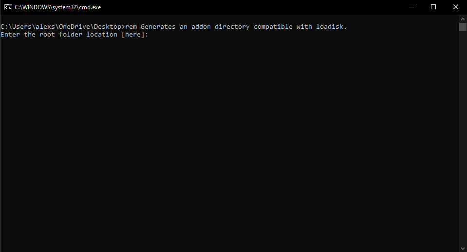
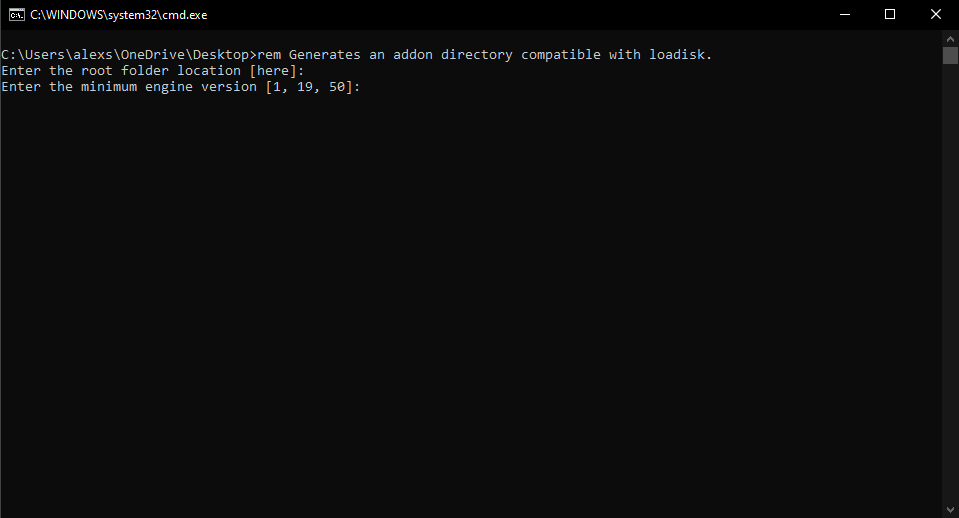
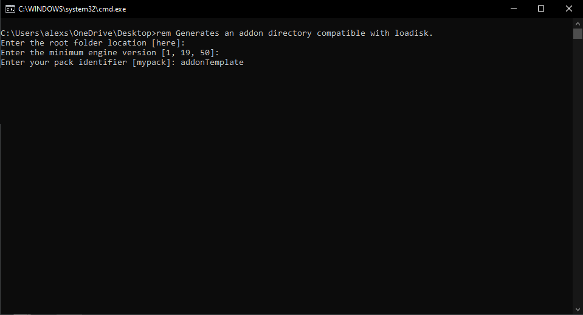
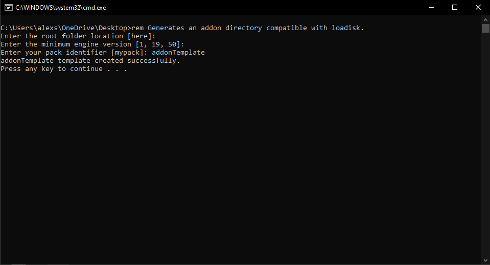

[Back](https://github.com/Voxel-Lab-Studios/Loadisk/blob/main/documentation/01_main.md)
# Getting Started With Loadisk

**To start making a loadisk powered addon first download the [ldPackGen](https://github.com/Voxel-Lab-Studios/Loadisk/raw/main/builds/ldPackGen1.0.0.zip) batch file.** 

This file generates a directory with the necessary files and folders required to maintain consistency and compatibility within the addon.

1. **run batch**
2. **Enter directory location** *(Note: if left empty files will generate with-in the root folder of the batch file)*
   
    

3. **Enter minimum engine version** *(Note: Default 1, 19, 50)*
   
    

4. **Enter Addon Name** *(Note: This is also used to create folder names so no space ids are recommended)*
   
    

5. **Loadisk will then generate the necessary folders and files for your addon, including functions, scripts, and codependent manifests.**
   
    

[Back](https://github.com/Voxel-Lab-Studios/Loadisk/blob/main/documentation/01_main.md)