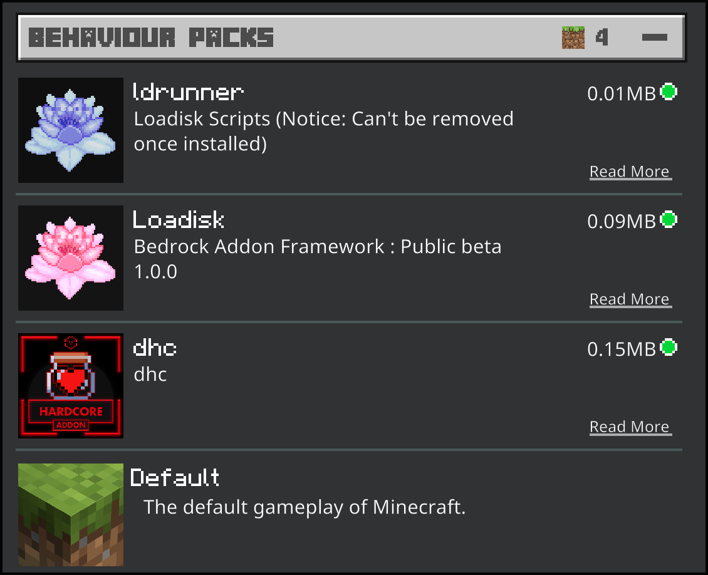
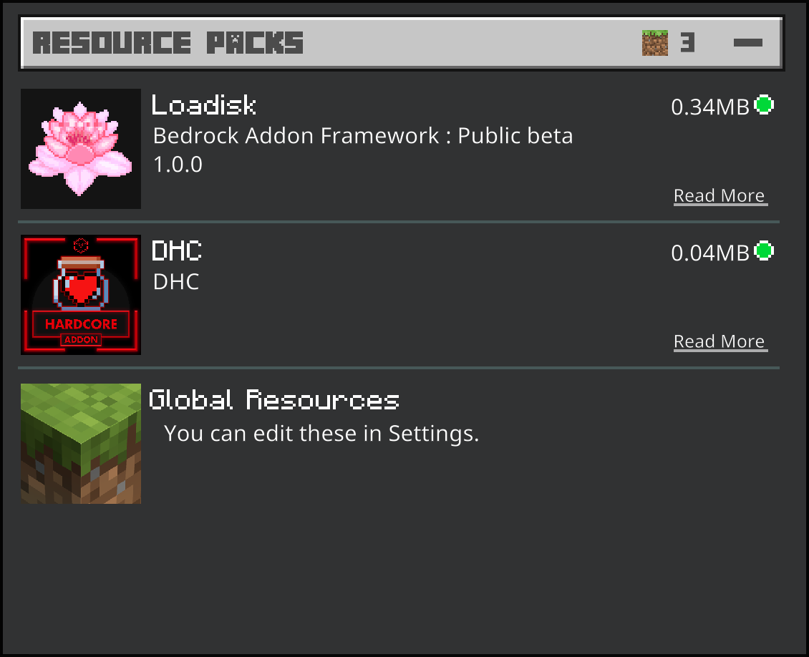

# Installation 

1. Install the most recent version of [LD Runner](https://github.com/voxeldon/Loadisk-Public/raw/main/builds/ldrunner1.0.0.mcpack)
   
   - ldRunner holds all the scripts utilized to operate loadisk

   - As scripts cannot be safely removed from a world after being installed, we've separated them from the core pack to eliminate potential corruption when installing future updates
---
2. Install the most recent version of [LD Library](https://github.com/voxeldon/Loadisk-Public/raw/main/builds/loadiskLib0.4.2.mcaddon)

   - ldLib contains all non-script files and is designed to be easily updatable
---
3. Install Loadisk compatible [Addons](https://github.com/voxeldon/Loadisk-Public/blob/main/documentation/feature/addons.md)
---

